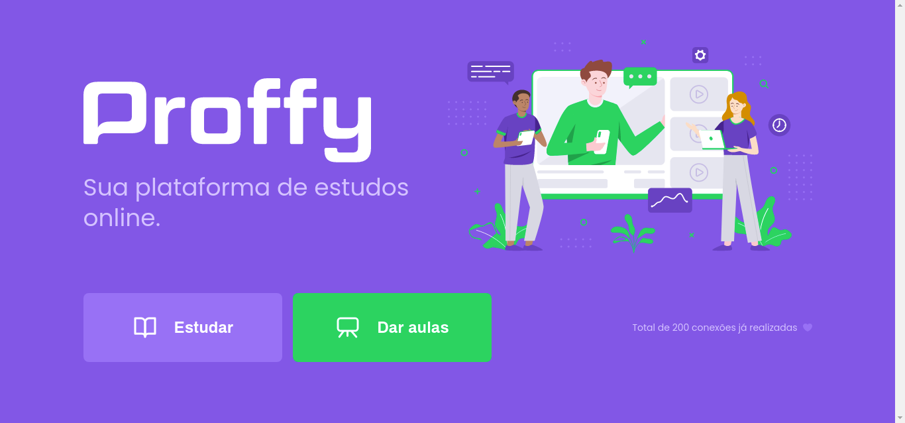

# 📚 Proffy | Next Level Week #2

All screens of the web front-end are <a href="https://github.com/ruifernandees/proffy/blob/master/web/README.md">here</a>

## 📝 Description
Proffy is a platform that we can hire private teachers. This application was created for study purposes in the event Next Level Week of Rocketseat (https://nextlevelweek.com).

## 💻 Technologies
- NodeJS (back-end)
- ReactJS (web front-end)
- React Native (mobile front-end)

## 🚀 Run on your machine
Note: it requires yarn installed 

> Initial steps
```bash
$ git clone https://github.com/ruifernandees/proffy.git
$ cd proffy
```

> Run back-end (API REST)
```bash

# Access the back-end folder
$ cd server

# Install all dependencies
$ yarn install

# Run all migrations
$ yarn knex:migrate

# Start the server
$ yarn start

```
> Run web front-end
```bash
# Access the web front-end folder
$ cd web

# Install all dependencies
$ yarn install

# Run the web project
$ yarn start
```
